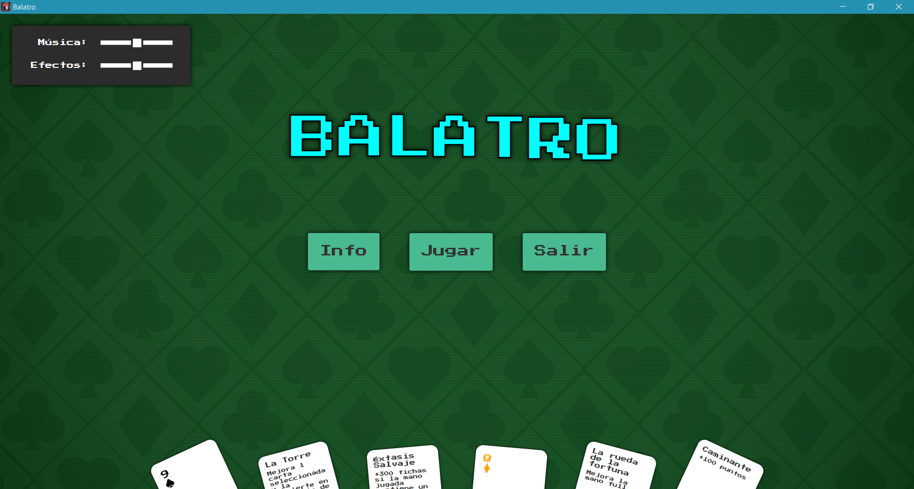
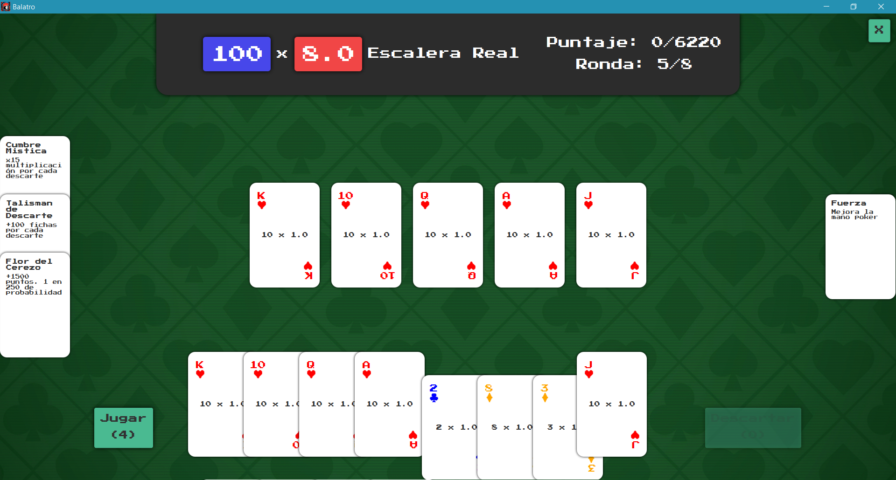

# TP2 Algoritmos 3: Balatro

Trabajo Práctico número 2 de la materia Algoritmos y Programación III de FIUBA.
El trabajo práctico consiste en reconstruir el juego de cartas [Balatro](https://store.steampowered.com/app/2379780/Balatro/) aplicando
las técnicas de desarrollo basadas en los principios del POO y TDD. Las herramientas de
desarrollo son Java, JUnit, JavaFX, Maven y Mockito.

## Grupo 1

* **Integrante 1** - [Salvador Pérez](https://github.com/salvaPerezMendoza)
* **Integrante 2** - [Francisco Russo](https://github.com/Zokalyx)
* **Integrante 3** - [Brian Conde](https://github.com/0OoBRIANoO0)
* **Integrante 4** - [Atuel Fullana](https://github.com/AtuelFullana)

Correctores: **Santiago Valdez** y **Lucas Aldonate**

## Capturas




## Aplicación
 
La versión más reciente de la aplicación puede encontrarse en la pestaña [releases](https://github.com/Zokalyx/Balatro/releases/latest) y ejecutarse en Linux, Windows o Mac de esta forma:

```bash
$ java -jar balatro.jar
```
